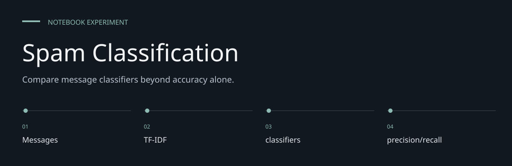
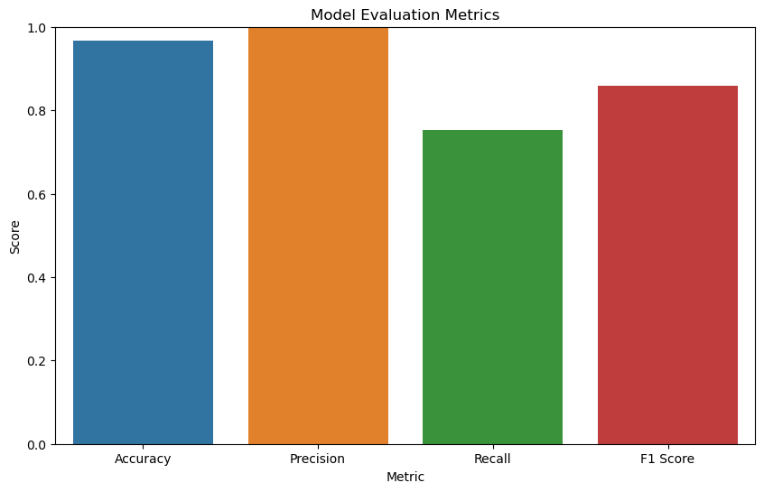

# Spam Classification

**Compare message classifiers beyond accuracy alone.**

> Compare four text classifiers on one recorded split; distinguish saved scores from a fresh run.

[Task_4.ipynb](Task_4.ipynb) labels messages as `ham` or `spam`. It prepares a CSV, fits a TF-IDF
vocabulary on training messages, evaluates Multinomial Naive Bayes, and compares logistic
regression,
a support-vector classifier and a random forest. No mail-server integration or deployed API is
built.


[Architecture](docs/ARCHITECTURE.md) · [Evaluation guide](docs/EVALUATION.md)

**Contents:** [The challenge](#the-challenge) · [Walkthrough](#walk-through-the-project) ·
[Implementation](#implementation-state) · [Design choices](#engineering-choices) ·
[Next evidence](#next-evidence-to-collect)

---

## The challenge

Labeled text messages provide an approachable way to inspect the relationship between inputs and
spam/ham label. This repository keeps that work in a notebook so preparation, computation and
saved outputs can be read together. Its value is an inspectable experiment, not a deployed
prediction service.



*Historical output embedded in [Task_4.ipynb](Task_4.ipynb), cell 23. Extracted unchanged from the
notebook; not a fresh experiment result.*

## System at a glance


## Walk through the project

### 1. Supply the input data

The required CSV files are not tracked. Obtain an authorized copy with the expected schema and
replace the author-specific absolute paths before execution.

### 2. Inspect the preparation

TF-IDF is fitted on the training text. Review the transformations and exclusions before rerunning;
an output cannot be understood separately from its input preparation.

### 3. Run the experiment

The implemented method is TF-IDF plus four classifiers. The CSV is read with Latin-1 encoding and
renamed columns. Execute in a fresh kernel to reveal ordering and dependency problems.

### 4. Read the diagnostics

Saved SVC accuracy is 0.976682, precision 0.992063 and recall 0.833333. Precision and recall
describe different errors; neither is implied by accuracy. RandomForest has no fixed seed; compare
saved outputs with a fresh run before relying on them.

## Inspect and reproduce

The notebook's saved outputs can be read directly on GitHub. For local execution:

```sh
python3 -m venv .venv
.venv/bin/python -m pip install jupyterlab pandas matplotlib seaborn scikit-learn
.venv/bin/python -m jupyter lab Task_4.ipynb
```

Obtain the matching `spam.csv` separately; it is not committed. Replace the notebook's local
`file_path` before running all cells. The loader uses Latin-1 encoding and expects `v1`, `v2` and
three `Unnamed` columns, which are dropped before renaming to `label` and `message`.
Package versions are unpinned; no exact historical environment is provided.

## Pipeline and recorded results

`CSV → label/message cleanup → 80/20 split → training-only TF-IDF → classifiers → metrics/charts`.
The split uses `random_state=42`: **4,457 training and 1,115 test messages** in the saved run.

| Classifier | Accuracy | Spam precision | Spam recall | Spam F1 |
|---|---|---|---|---|
| Multinomial Naive Bayes | 0.9668 | 1.0000 | 0.7533 | 0.8593 |
| Logistic regression | 0.9525 | 0.9709 | 0.6667 | 0.7905 |
| Support-vector classifier | 0.9767 | 0.9921 | 0.8333 | 0.9058 |
| Random forest | 0.9740 | 0.9919 | 0.8133 | 0.8938 |

These are saved outputs inspected on **7 October 2026**, not newly executed measurements.
Naive Bayes has high recorded precision but misses some spam: precision and recall answer
different questions. Comparing several models on the same test set is not a separate final
held-out assessment.

## What is built, and what is missing

Built: preprocessing, sparse text features, four classifier fits, metrics and comparison plots.
Missing: supplied CSV, locked environment, persisted pipeline, automated tests, independent
validation, drift monitoring and email integration. The random forest does not pin its random seed.

The data is message text; the repository name does not prove email-specific performance.
Dataset provenance/licensing and class-level error analysis remain necessary before wider reuse.
Saved accuracy does not establish reliable performance on new senders, languages or spam campaigns.

## Engineering choices

**Inputs are explicit.** message text, spam/ham training label.

**Method is inspectable.** TF-IDF plus four classifiers is the implemented method; no broader
modeling capability is inferred.

**Historical evidence is labeled.** Saved SVC accuracy is 0.976682, precision 0.992063 and recall
0.833333. Precision and recall describe different errors; neither is implied by accuracy.

## Implementation state

| State | Current evidence |
| --- | --- |
| Present | Notebook source and historical saved outputs |
| Required externally | Authorized CSV input and compatible Python packages |
| Not rerun | Data-dependent execution in this documentation pass |
| Not supplied | Deployment service, model registry or automated behavior suite |

The [architecture guide](docs/ARCHITECTURE.md) maps these statements to source entry points.
The [evaluation guide](docs/EVALUATION.md) separates inspection, executable checks and
domain validation, with the next evidence needed for each project.

## Next evidence to collect

- Supply data provenance and a reproducible local path.
- Record a fresh-kernel run with package versions.
- Evaluate stability across independent samples before widening any performance claim.
